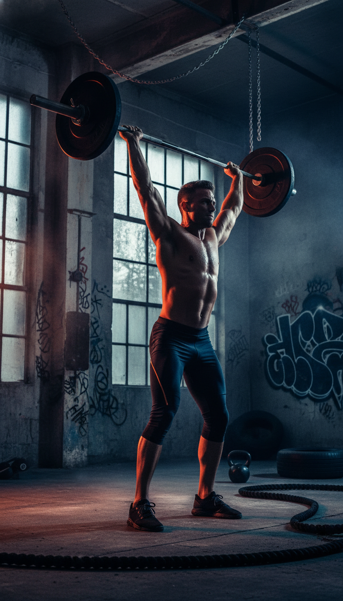

# 🏋️ Iron Pulse — High-Performance Gym Website

> A modern, responsive gym website built with React + Vite. Designed for elite athletes and high-performance training culture.



---

## 📌 Overview

**Iron Pulse** is a full-featured frontend web application for a fictional high-performance gym brand. The project showcases a bold, athletic visual identity with a dark color palette, italic typography, and fluid responsive layouts. Built as a portfolio project under [MCCreative Studio](https://mccreativestudio.de).

> **Live Demo:** _coming soon_
> **Status:** 🚧 In Development

---

## 📸 Screenshots

| Desktop | Tablet | Mobile |
|--------|--------|--------|
|  |  |  |

> _Screenshots will be updated as the project progresses._

---

## ⚙️ Tech Stack

| Layer | Technology |
|-------|-----------|
| Framework | [React 18](https://react.dev/) |
| Build Tool | [Vite](https://vitejs.dev/) |
| Routing | [React Router v6](https://reactrouter.com/) |
| Styling | Plain CSS (Nested CSS, CSS Variables) |
| Icons | [React Icons](https://react-icons.github.io/react-icons/) |
| Deployment | [Vercel](https://vercel.com/) |

---

## 🚀 Getting Started

### Prerequisites

Make sure you have the following installed:

- [Node.js](https://nodejs.org/) `v18+`
- [npm](https://www.npmjs.com/) or [yarn](https://yarnpkg.com/)

### Installation

```bash
# 1. Clone the repository
git clone https://github.com/your-username/Iron-Pulse.git

# 2. Navigate into the project
cd IronPulse

# 3. Install dependencies
npm install

# 4. Start the development server
npm run dev
```

The app will be running at `http://localhost:5173`

### Build for Production

```bash
npm run build
```

### Preview Production Build

```bash
npm run preview
```

---

## 📁 Project Structure

```
iron-pulse/
├── public/
│   ├── logo/
│   │   └── logo1.png
│   ├── landing/
│   │   └── hero.png
│   └── screenshots/
├── src/
│   ├── components/
│   │   ├── Navbar/
│   │   │   ├── Navbar.jsx
│   │   │   └── Navbar.css
│   │   ├── Landing/
│   │   │   ├── Landing.jsx
│   │   │   └── Landing.css
│   │   ├── Metrics/
│   │   │   ├── Metrics.jsx
│   │   │   └── Metrics.css
│   │   ├── Services/
│   │   │   ├── Services.jsx
│   │   │   └── Services.css
│   │   ├── UserFeedback/
│   │   │   ├── UserFeedback.jsx
│   │   │   └── UserFeedback.css
│   │   └── JoinPuls/
│   │       ├── JoinPuls.jsx
│   │       └── JoinPuls.css
│   ├── App.jsx
│   ├── main.jsx
│   └── index.css
├── index.html
├── vite.config.js
└── package.json
```

---

## 📄 Pages & Components

### Pages

| Route | Page | Description |
|-------|------|-------------|
| `/` | Home (Landing) | Hero section, metrics, services, reviews, CTA |
| `/about` | About | Brand story and gym philosophy |
| `/programs` | Programs | Training programs and packages |
| `/coaches` | Coaches | Coach profiles and specializations |
| `/locations` | Locations | Gym locations and contact info |

### Key Components

| Component | Description |
|-----------|-------------|
| `Navbar` | Fixed navigation with mobile hamburger menu and overlay |
| `Landing` | Full-viewport hero with CTA buttons |
| `Metrics` | Key stats (members, coaches, locations, etc.) |
| `Services` | Service cards grid |
| `UserFeedback` | Member testimonials / reviews section |
| `JoinPuls` | Bottom CTA / membership join section |

---

## 📐 Responsive Breakpoints

| Breakpoint | Target Device | Notes |
|-----------|--------------|-------|
| `> 1024px` | Desktop | Full navbar with links, desktop layout |
| `≤ 1024px` | Large Tablet | Hamburger menu appears, side drawer navigation |
| `≤ 768px` | Tablet | Adjusted font sizes, wider content areas |
| `≤ 430px` | Mobile | Full-height hero, stacked buttons, compact layout |

---

## 🎨 Design System

### Colors (CSS Variables)

```css
--primary-t60   /* Orange accent — buttons, highlights */
--primary-t80   /* Lighter orange — text accents, headings */
--secondary-t50 /* Secondary tone — hover states */
--secondary-t80 /* Secondary text — nav links */
/* And more */
```

### Typography

- Display / Hero: **italic, uppercase, black weight** — bold athletic feel
- Body: **thin / light weight** — clean and readable contrast
- Root font size: `62.5%` → `1rem = 10px` for easy `rem` calculations

---

## 🗺️ Roadmap

- [x] Navbar with responsive mobile menu
- [x] Hero landing section
- [x] Metrics section
- [x] Services section
- [x] User feedback / testimonials
- [x] Join CTA section
- [ ] About page
- [ ] Programs page
- [ ] Coaches page
- [ ] Locations page
- [ ] Contact / membership form
- [ ] Page transition animations
- [ ] SEO meta tags
- [ ] Vercel deployment + custom domain

---

## 👨‍💻 Author

**Musa Çekçen** — Frontend Developer & Founder of MCCreative Studio

- 🌐 [mccreativestudio.de](https://mccreativestudio.de)
- 💼 [LinkedIn](https://linkedin.com/company/mccreative-studio)
- 📧 musa@mccreativestudio.de

---

## 📜 License

This project is a portfolio piece created by MCCreative Studio. All rights reserved.